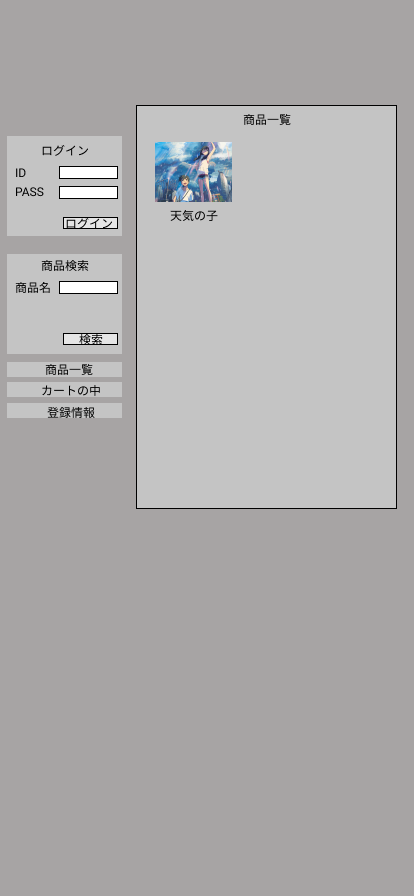

### 画面詳細図
## トップページ
### プロトタイプは以下のリンク先
[プロトタイプ](https://www.figma.com/file/CWmWiQZnGznjvnWNRnL5kz/Untitled?node-id=4%3A5)
*****

*****
補足 : 対応DBの列はDB設計後、〇を対応するテーブル・カラム名に差し替えること。

| ID | 要素 | 内容 | アクション | イベント | 対応DB |
|----|-----|------|------------|-----------|-------|
|1   |バナー|サイト名表示|-    |-           |-     |
|2   |ログイン|テキスト画像|-    |-         |-      |
|3   |ID      |入力欄     |テキスト入力    |      |〇 |
|4   |PASS    |入力欄     |テキスト入力    |      |〇 |
|5   |ログインボタン|ログイン|クリック     |ログイン実行|     |
|6   |商品検索|本の画像   |    |           |            |

